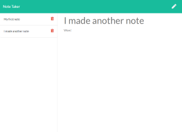

# Note Taker
[](https://lbesson.mit-license.org/)



## Description
Note taker provides a clean and simple interface for writing notes. The intuitive workflow allows you to quickly write and save notes, view previously written notes, and delete notes. All of your notes are stored as JSON objects serverside, so they will always be there when you need them.

## Table of Contents
* [Installation](#Installation)
* [Usage](#Usage)
* [Questions](#Questions)

## Installation
To install necessary dependencies, run the following command:
```
npm install
``` 

## Usage
This application is deployed through Heroku at https://cryptic-caverns-17278.herokuapp.com/. To run the application locally, after cloning the repo run `node server.js` then navigate to localhost: 3000 with your browser.

## Questions
Find all of my repos at elijah415hz. 

Please email me at elijahblaisdell@gmail.com with any questions.
